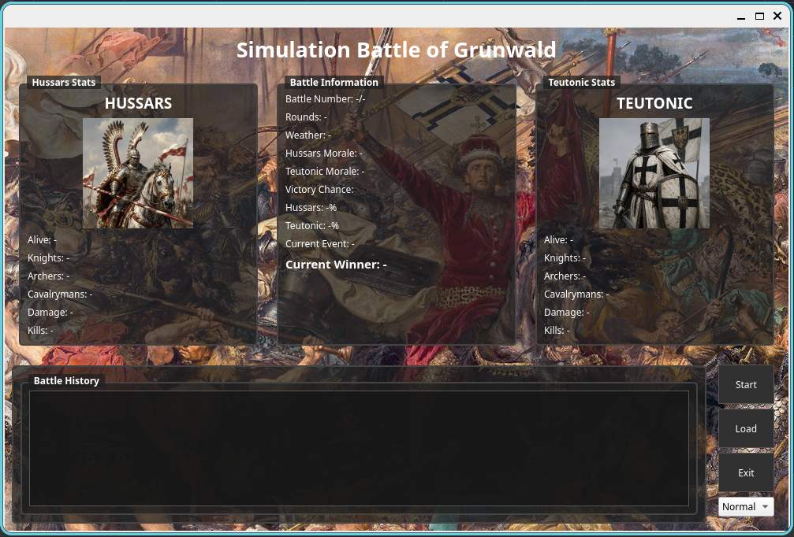
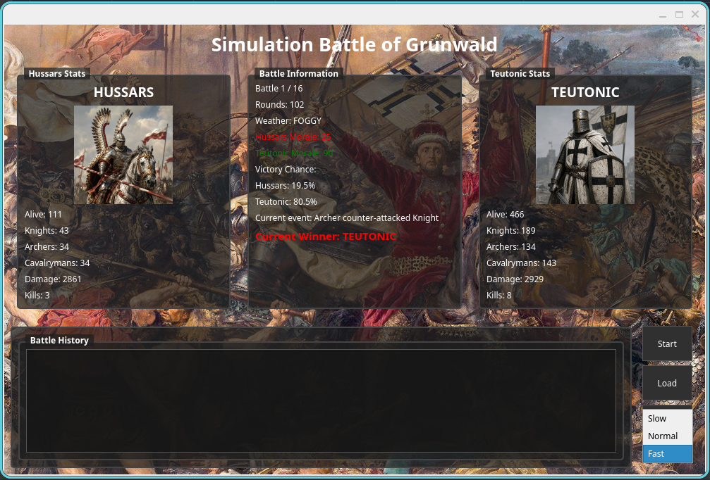
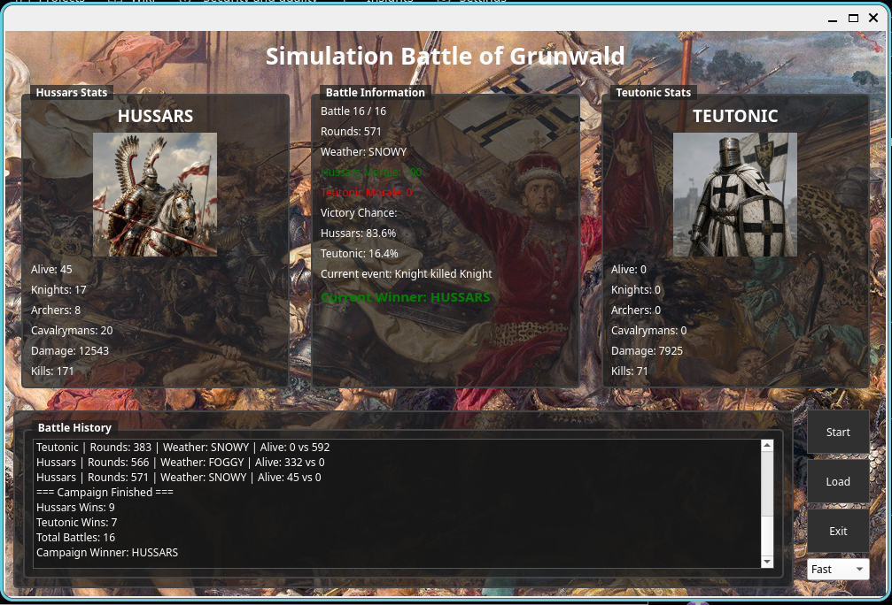

# ⚔️ Simulation Battle of Grunwald

Simulation Battle of Grunwald is an object-oriented desktop application written in **C++** using the **Qt** framework. The project simulates battles between the Hussar and Teutonic armies, taking into account different unit types, weather conditions, morale, and random battlefield events.

The application supports both single battles and multi-battle campaigns, providing real-time statistics, battle reports, and CSV export for further analysis.

### Main Window

### Battle Simulation

(assets/anotherbattle.png)

### Battle History

## Features

* ⚔️ Real-time battle simulation
* 🏹 Multiple unit types (Knight, Archer, Cavalryman)
* 🌦 Dynamic weather system
* 🎲 Random battlefield events
* 📈 Live battle statistics
* 📊 Victory probability estimation
* 📄 Automatic CSV battle reports
* 🖥 Qt-based graphical user interface

## Technologies

* C++23
* Qt
* CMake
* Catch2 (unit testing)
* Doxygen
* PlantUML

## Object-Oriented Programming

The project demonstrates the practical use of object-oriented programming concepts:

* Encapsulation
* Inheritance
* Polymorphism
* Composition
* Observer design pattern
* Smart pointers (`std::shared_ptr`, `std::unique_ptr`)

## Documentation

The repository contains:

* Project report
* UML diagrams (Class, Object, Sequence, State Machine)
* Doxygen-generated documentation
* Unit tests

## Authors
Bartosz Marcińczyk & Bartek P.

Project created as part of the **Object-Oriented Programming** course.
